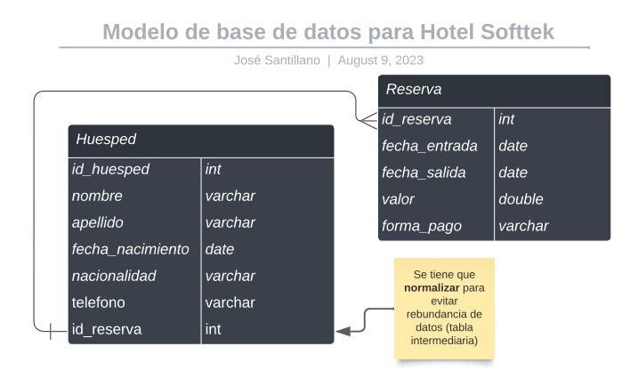

# Documentación de API Rest Hotel Softtek v1.0.0
## Descripción del proyecto

Este proyecto radica en la creación de una API Rest que pueda crear un huesped 
con "x" reservaciones. Ya que la relación es que un huesped puede tener muchas 
reservaciones, por lo tanto el diagrama queda de la siguiente manera.



## Recursos
El proyecto esta creado con las siguientes tecnologías, las primeras 4 se obtienen
al momento de crear el proyecto.

| Plugin                | URL                      |
|-----------------------|--------------------------|
| Spring Web            | https://start.spring.io/ |
| Spring Data JPA       | https://start.spring.io/ |
| Lombok                | https://start.spring.io/ |
| H2 Database           | https://start.spring.io/ |
| Spring Doc (opcional) | https://springdoc.org/#getting-started |

## Accesos

Acceso a la base de datos H2 mediante URL:

```sh
url: http://localhost:8080/hotel-softtek/h2-console/
user: sa
password: 
```


Acceso a la UI de la documentación de la API mediante URL:
```sh
url: http://localhost:8080/hotel-softtek/swagger-ui/index.html#/
```


## Uso en Postman

### GET
```sh
http://localhost:8080/hotel-softtek/api/v1/huespedes
```

### POST (crear Huesped)
```sh
http://localhost:8080/hotel-softtek/api/v1/huespedes
```
Hay que insertar un JSON para esta petición.

``` json
{
    "nombre": "Juan",
    "apellido": "Pérez",
    "fechaNacimiento": "1990-05-15",
    "nacionalidad": "Mexicana",
    "telefono": "555-123-4567",
    "reservas": [
        {
            "fechaEntrada": "2024-07-10",
            "fechaSalida": "2024-07-11",
            "valor": 3500.0,
            "formaPago": "Tarjeta"
        },
        {
            "fechaEntrada": "2024-07-10",
            "fechaSalida": "2024-07-11",
            "valor": 300.0,
            "formaPago": "Tarjeta"
        }
    ]
}
```

### POST (editar Huesped)
```sh
http://localhost:8080/hotel-softtek/api/v1/huespedes/editar/1
```

Hay que insertar un JSON para esta petición.

``` json
{
    "idHuesped": 1,
    "nombre": "José",
    "apellido": "Pérez",
    "fechaNacimiento": "1990-05-15",
    "nacionalidad": "Mexicana",
    "telefono": "555-123-4567",
    "reservas": [
        {
            "idReserva": 1,
            "fechaEntrada": "2024-07-10",
            "fechaSalida": "2024-07-11",
            "valor": 3500.0,
            "formaPago": "Bono"
        },
        {
            "idReserva": 2,
            "fechaEntrada": "2024-07-10",
            "fechaSalida": "2024-07-11",
            "valor": 500.0,
            "formaPago": "Efectivo"
        }
    ]
}
```

### DELETE
```sh
http://localhost:8080/hotel-softtek/api/v1/huespedes/eliminar/1
```

## Para más información

Documentación breve en PDF: https://drive.google.com/file/d/1GlqeqsH1d5d3eH7ZG4n1kyx3vyxWl40e/view?usp=drive_link

Material de apoyo: https://www.stackchief.com/blog/One%20To%20Many%20Example%20%7C%20Spring%20Data%20JPA

Añadir SpringDoc: https://springdoc.org/#getting-started
